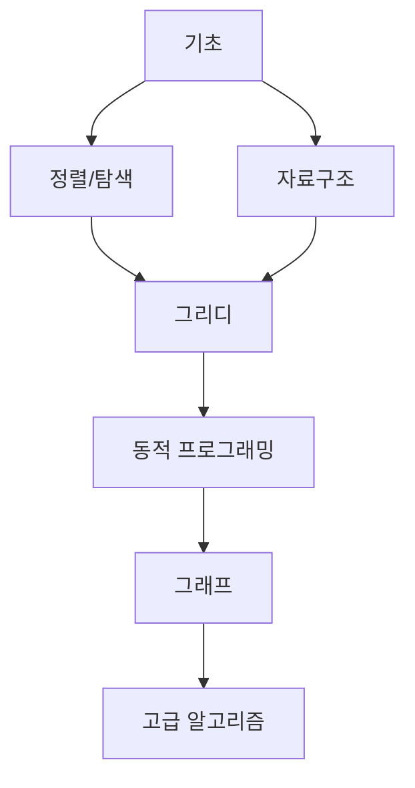

# 🧮 알고리즘과 수학의 관계

> 같은 문제, 다른 접근법 - 알고리즘으로 효율성을 극대화하기

## 💡 알고리즘이란?

**알고리즘(Algorithm)**: 문제를 해결하는 구체적인 절차와 방법

생각보다 우리 주변에서 자주 접하는 개념입니다. 요리 레시피, 출퇴근 경로, 쇼핑 리스트 작성 모두 알고리즘의 일종이죠!

---

## 📊 실전 예제: 1부터 100까지 합 구하기

같은 문제를 두 가지 방식으로 해결해보겠습니다.

### ❌ 방법 1: 무식하게 하나씩 더하기

```text
1 + 2 = 3
3 + 3 = 6
6 + 4 = 10
7 + 4 = 14
...
4950 + 100 = 5050
```

**특징:**

- 💪 장점: 구현이 쉽고 직관적
- 😰 단점: 총 99번의 덧셈 필요 (시간 복잡도: O(n))
- ⏱️ 계산 시간: 손으로 하면 약 5분 이상

```java
// Java 코드로 표현하면
public int sumBruteForce(int n) {
    int sum = 0;
    for (int i = 1; i <= n; i++) {
        sum += i;  // 99번 반복
    }
    return sum;
}
```

---

### ✅ 방법 2: 수학적 패턴 활용하기

**핵심 아이디어:** 합이 101인 쌍으로 묶기

```text
(1 + 100) + (2 + 99) + (3 + 98) + ... + (50 + 51)
= 101 × 50
= 5,050
```

**수학 공식화:**

```
n(n + 1) / 2 = 100 × 101 / 2 = 5,050
```

**특징:**

- 🚀 장점: 단 한 번의 계산으로 해결 (시간 복잡도: O(1))
- ⏱️ 계산 시간: 1초 미만
- 📈 효율성: 방법 1 대비 **99배 빠름**

```java
// Java 코드로 표현하면
public int sumOptimized(int n) {
    return n * (n + 1) / 2;  // 단 1번의 계산
}
```

---

## 🎯 알고리즘이 해결하는 실생활 문제들

| 문제 영역        | 구체적 예시                 | 활용 알고리즘       |
| ---------------- | --------------------------- | ------------------- |
| 🗺️ **경로 탐색** | 김포공항 → 판교역 최단경로  | 다익스트라, A\*     |
| 🛒 **최적화**    | 5000원으로 최대 칼로리 구매 | 배낭 문제(Knapsack) |
| 📊 **집계**      | 방문객 수 빠르게 계산       | 누적 합(Prefix Sum) |
| 🔢 **정렬**      | 시험 성적 순위 매기기       | 퀵정렬, 병합정렬    |
| 💰 **탐욕법**    | 최소 지폐로 거스름돈 계산   | 그리디 알고리즘     |
| 🎬 **스케줄링**  | 최대한 많은 영화 보기       | 활동 선택 문제      |
| 📖 **탐색**      | 사전에서 단어 찾기          | 이진 탐색           |

### 💭 사전 탐색의 예

**비효율적 방법:**

```
a → aardvark → aback → abacus → ... → technology
```

처음부터 끝까지 순차 탐색 → 수천 개의 단어 확인 필요

**효율적 방법:**

```
1. 중간 페이지 펼치기 (예: m으로 시작하는 부분)
2. technology는 t로 시작 → 뒷부분으로 이동
3. 다시 중간 펼치기 → 범위를 절반씩 좁혀가기
```

이진 탐색으로 탐색 범위를 절반씩 줄임 → 10번 이내 발견

---

## ⚠️ 비효율적 알고리즘의 위험성

### 📈 폭발적인 계산 횟수 문제

**문제 상황:** 편의점에서 5000원으로 최대 칼로리 조합 찾기

#### 물건 개수별 경우의 수

| 물건 개수 | 경우의 수                 | 표현            |
| --------- | ------------------------- | --------------- |
| 10개      | 1,024                     | 2^10            |
| 20개      | 1,048,576                 | 2^20 (약 100만) |
| 30개      | 1,073,741,824             | 2^30 (약 10억)  |
| 40개      | 1,099,511,627,776         | 2^40 (약 1조)   |
| 60개      | 1,152,921,504,606,846,976 | 2^60 (약 115경) |

### 💻 컴퓨터의 한계

**일반 PC 성능:**

- 1초에 약 **10억 번(10^9)** 연산 가능
- 하지만 60개 물건의 모든 조합을 확인하려면?

```
115경 ÷ 10억 = 약 11.5억 초
= 약 19,200,000시간
= 약 2,191년 😱
```

**현실적 해결책:**

```java
// ❌ 모든 경우의 수 확인 (지수 시간)
public void bruteForce(int[] items) {
    for (int i = 0; i < Math.pow(2, items.length); i++) {
        // 2^60 번 반복... 불가능!
    }
}

// ✅ 동적 프로그래밍 활용 (다항 시간)
public int knapsack(int[] weights, int[] values, int capacity) {
    int[][] dp = new int[weights.length + 1][capacity + 1];
    // O(n × W) 시간에 해결!
    return dp[weights.length][capacity];
}
```

---

## 🚀 좋은 알고리즘의 중요성

### 시간 복잡도 비교

```
문제 크기: n = 1,000일 때

O(1)         →        1번 (상수 시간)
O(log n)     →       10번 (로그 시간)
O(n)         →    1,000번 (선형 시간)
O(n log n)   →   10,000번 (준선형 시간)
O(n²)        → 1,000,000번 (제곱 시간)
O(2^n)       →      ∞ (지수 시간) - 현실적으로 불가능
```

### 💎 핵심 원칙

1. **문제를 잘 분석하라**
   - 무식하게 모든 경우를 시도하지 말 것
   - 패턴과 규칙성을 찾을 것

2. **검증된 알고리즘을 활용하라**
   - 이미 연구된 고전 알고리즘 학습
   - 바퀴를 다시 발명하지 말 것

3. **시간 복잡도를 고려하라**
   - Big-O 표기법으로 효율성 판단
   - 데이터 크기가 커졌을 때를 대비

---

## 📚 학습해야 할 고전 알고리즘

### 필수 알고리즘 로드맵



**단계별 학습 추천:**

1. 🥉 **초급**: 정렬, 이진 탐색, 스택/큐
2. 🥈 **중급**: 그리디, DFS/BFS, 동적 프로그래밍
3. 🥇 **고급**: 최단경로, 최소 신장 트리, 분할정복

---

## 💡 실무에서의 알고리즘

### Spring Boot 개발자의 실제 활용

```java
// 1. 페이징 처리 최적화
public Page<User> getUsers(Pageable pageable) {
    // N+1 문제 해결: 즉시 로딩 대신 페치 조인
    return userRepository.findAllWithFetchJoin(pageable);
}

// 2. 캐싱 전략
@Cacheable(value = "products", key = "#id")
public Product getProduct(Long id) {
    // O(1) 시간에 조회 가능
    return productRepository.findById(id);
}

// 3. 벌크 연산 최적화
public void updatePrices(List<Long> ids, int discount) {
    // 한 번에 처리: O(1) vs 반복문: O(n)
    productRepository.bulkUpdatePrice(ids, discount);
}
```

---

## 🎯 핵심 요약

| 구분              | 내용                          |
| ----------------- | ----------------------------- |
| **알고리즘 정의** | 문제를 해결하는 효율적인 절차 |
| **중요한 이유**   | 같은 결과, 천문학적 시간 차이 |
| **핵심 원칙**     | 시간 복잡도를 항상 고려       |
| **학습 방법**     | 고전 알고리즘 → 응용 → 최적화 |
| **실무 적용**     | DB 쿼리, 캐싱, 자료구조 선택  |

---

## 🔥 마무리

> "좋은 알고리즘은 2년 걸릴 작업을 2초로 줄입니다"

컴퓨터는 빠르지만 무한하지 않습니다. 데이터가 많아질수록 효율적인 알고리즘의 중요성은 기하급수적으로 커집니다. 백엔드 개발자라면 더욱 알고리즘에 대한 이해가 필수입니다! 💪
